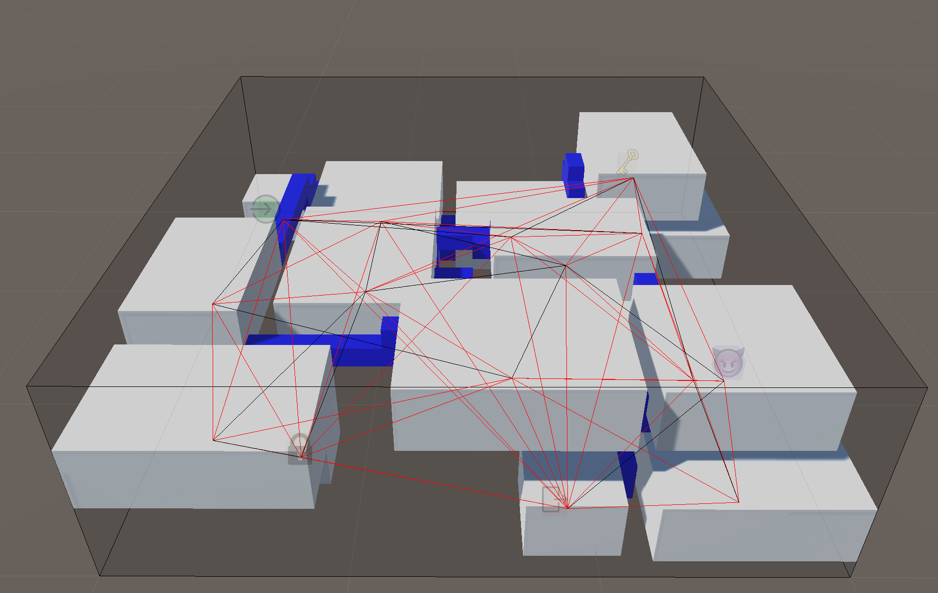
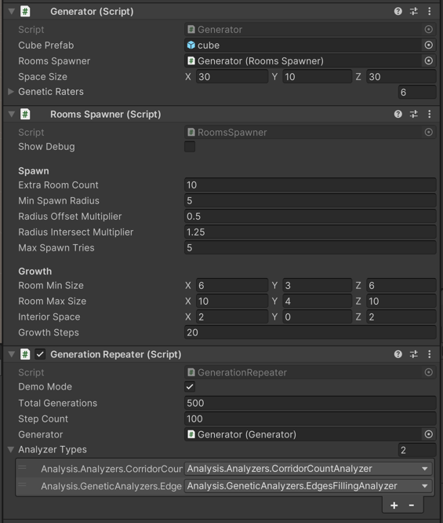
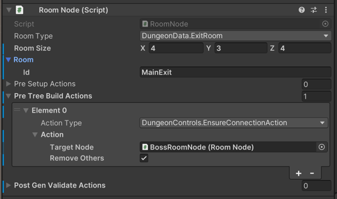
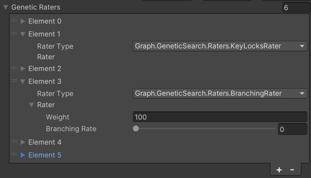

# Генерация трехмерных подземелий с учетом маркеров в пространстве
Данная работа является генератором подземелий в трехмерном пространстве. Основной особенностью генератора является использование маркеров, расставленных в пространстве и использующихся при создании комнат и коридоров. Генерация подразумевает следующие этапы: ручная расстановка маркеров, генерация комнат, триангуляция связей на основе центров комнат, выбор подгафа при помощи генетического алгоритма и построение путей алгоритмом А*.

Проект является частью магистерской выпускной квалификационной работы по образовательной программе "Технологии разработки компьютерных игр" [Школы разработки видеоигр Университета ИТМО](https://itmo.games/). Вся работа написана на языке C# в игровом движке UNITY.

## Обзор
Скриншот ниже представляет пример результата работы генератора. Для примера использовалось подземелье с шириной и глубиной в 30 ячеек, а высотой в 10 ячеек, что дает суммарный объем в 9.000 ячеек. Также, вручную были размещены пять изначальных комнат – входа, выхода, босса, комната с ключом и, соответствующая ей, закрытая комната. Была добавлена обязательная связь комнаты босса с выходом, а также целью являлась минимизация количества коридоров и разветвленности подземелья.

Темносерым отмечена область работы генератора. Белыми параллелограммами – комнаты, среди которых определенные типы отмечены специальными значками-маркерами. Красными линиями отмечены первичные связи комнат, а черными – оставшиеся после минимизации их числа. Синим построены коридоры между комнат.

## Запуск и использование
Работа является проектом, разработанным в Unity. Для запуска достаточно скачать репозиторий и открыть его через Unity Hub. Собранная тестовая сцена находится по пути **_Assets/Scenes/SampleScene.unity_** и содержит настройки из Обзора.

### Основные компоненты
Генерация запускается через метод **_StartGeneration_** компонента **_Generator_**. В этом же компоненте можно выставить размеры используемого пространства. Компонент **_Rooms Spawner_** содержит настройки генерации комнат. Параметр **_Show Debug_** позволяет включить отображение ячеек, "занятых" ядрами комнат.

Для тестирования генератора предоставлен компонент **_Generation Repeater_**, который функционирует в 2х режимах:
- Предпросмотр (Demo Mode = On)  – генерация одного подземелья, включая его отображение на сцене
- Тестирование (Demo Mode = Off) – множественная генерация **_Total Generations_** подземелий с выводом логов каждые **_Step Count_** подземелий. **НЕ** отрисовывает подземелья на сцене. Также можно указать **_Типы анализаторов_**, которые выведут результаты в соответствующие CSV файлы

### Настройки маркеров

Для добавления маркеров комнат нужно добавить компонент **_RoomNode_** на новый GameObject или же можно использовать префаб **_Assets/Prefabs/RoomNode.prefab_**. Настройки доступные для маркеров:
- Позиция – определяется позицией GameObject-a
- Room Size – желаемый размер комнаты
- Room Type – тип комнаты, генерируемой маркером
- Room – настройки комнаты, которые зависят от выбранного типа
- Pre Setup Actions – действия генерации, вызывающиеся перед этапом создания комнат
- Pre Tree Build Actions – действия генерации, вызывающиеся перед построением подграфа связей комнат
- Post Gen Validate Actions – действия генерации, вызывающиеся после работы генератора

### Функции оценки генератора связей

У компонента **_Generator_** можно указать объекты-оценщики, которые будут влиять на отбор ребер в полученом после триангуляции Делоне графе. Оценщики могут быть "обязательными" – не пропускающими решение, если оно не подходит, и "взвешенными" – оказывающими установленное влияние на конечный результат. Доступные оценщики:
- Graph Component Rater – устанавливает **обязательным** условием достижимость всех комнат
- Key Locks Rater – устанавливает **обязательным** условием возможность открыть все закрытые комнаты
- Edges Count Rater – устанавливает **взвешенное** условие для процентного количества дополнительных коридоров
- Edges Length Rater – устанавливает **взвешенное** условие для средней относительной длины коридоров
- Slope Rater – устанавливает **взвешенное**  условие для среднего относительного наклона коридоров
- Branching Rater – устанавливает **взвешенное** условие для разветвленности подземелья

## Дополнительно

Полный текст работы можно найти [на GitHub](Docs/MarkerDungeonGeneration.pdf)

Кодстайл для языка С# соответствует таковому указанному на [сайте Microsoft](https://learn.microsoft.com/en-us/dotnet/csharp/fundamentals/coding-style/identifier-names)

